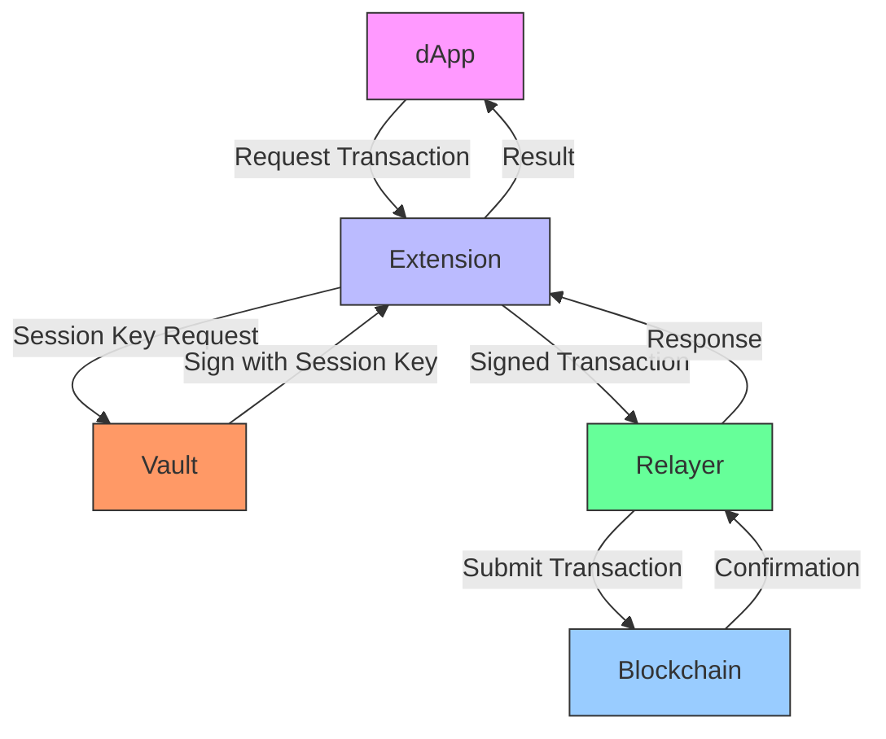

# Architecture Flow: dApp → Extension → Relayer → Blockchain

This diagram illustrates the transaction flow through the Ancore system, highlighting key components and their interactions.

## Key Components
- **dApp**: Initiates transaction requests.
- **Extension**: Manages session keys and forwards requests.
- **Vault**: Signs transactions with session keys.
- **Relayer**: Submits signed transactions to the blockchain.
- **Blockchain**: Executes and confirms transactions.

## Flow Description
1. The dApp sends a transaction request to the Extension.
2. The Extension requests a session key from the Vault.
3. The Vault signs the transaction with the session key and returns it to the Extension.
4. The Extension forwards the signed transaction to the Relayer.
5. The Relayer submits the transaction to the Blockchain.
6. The Blockchain processes the transaction and sends a confirmation to the Relayer.
7. The Relayer returns the response to the Extension, which forwards it to the dApp.